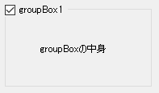

[GroupEnabledCheckBox]

Copyright (c) 2015 JFactory(manbou404)

This software is released under the MIT License.
http://opensource.org/licenses/mit-license.php

**GroupEnabledCheckBox**は、GroupBoxにEnable/Disableを切り替えるチェックボックスを付ける。

**GroupEnabledCheckBox**は、CheckBoxから派生しており、GroupBoxの左上に重なるように
自分自身の位置やZオーダを制御する。

+ GroupEnabledCheckBox.GroupBoxプロパティ  
  寄生するGroupBoxを指定する。
+ GroupEnabledCheckBox.Checkプロパティ  
  GroupBox.Enabledとリンクしている。
+ GroupBox.Textプロパティ  
  TextChangedイベントでTextを空にし、GroupEnabledCheckBox.Textにコピーする。

