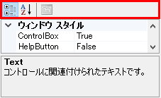
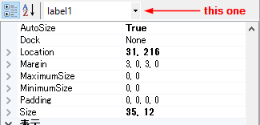

[PropertyGridHelper,PropertyGridWithControlSelector]

Copyright (c) 2015 JFactory(manbou404)

This software is released under the MIT License.
http://opensource.org/licenses/mit-license.php


# PropertyGridHelper.GetToolStrip

PropertyGridは、Toolbarに選択できないPropertyボタンがある。  
  
この赤枠で囲った部分は、実は普通のToolStripだが、アクセス手段が用意されていない。

```
// toolStripを取得  
var toolStlip = propertyGrid1.GetToolStrip();  
toolStlip.Items.RemoveAt(2);               // 非表示の謎ボタンを削除  
toolStlip.Items.RemoveAt(3);               // 押せないプロパティボタンを削除  
```

# PropertyGridWithControlSelector

Controlの開発時に便利な、Controlセレクタ付きのPropertyGrid  
  

* TargetControlプロパティ  
  指定ControlのControlsから、Nameプロパティが設定してあるものをComboの対象にする。

* SelectedItemプロパティ  
  Comboで選択されたアイテムの設定/取得  
  変更イベントは実装していない(Control開発用なので不要かと)

1. Formに貼り付けて、TargetControlに自分(MainForm)を設定する。   
   (デザイナにて) 

2. 最初に選択しておきたいControlを設定する
  '''this.propertyGridWithControlSelector1.SelectedItem = this.label1;'''


